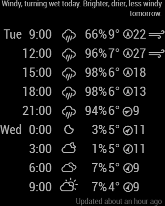
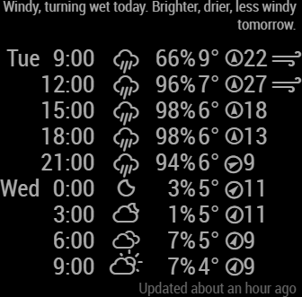
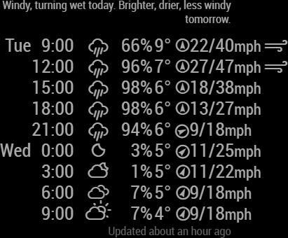

# MMM-metoffice-datapoint
Magic Mirror Module to show 3 hourly data from the UK Met Office Datapoint API
This an extension for [MagicMirror](https://magicmirror.builders/) that adds localized weather using the <a href="https://www.metoffice.gov.uk/datapoint" target="_blank">UK MetOffice Datapoint API</a>).

<table>
  <thead><tr><td>default</td><td>compact</td><td>all columns</td></tr></thead>
  <tbody>
    <tr style="valign:center;">
      <td style="background-color:black;"></td>
      <td style="background-color:black;"></td>
      <td style="background-color:black;"></td>
    </tr>
  </tbody>
  </table>

Credit where credit is due, this is a modified version of [MMM-darksky-hourly](https://github.com/jacquesCedric/MMM-darksky-hourly) which is itself a "heavily modified version of MMM-forecast-io".


## About the Data Source used

The UK Met Office provide a public API, called DataPoint, that this module uses for its data source. The forecasts are for many sites (5,000) around the UK and are given for 3 hour samples. 

Use of this data requires me to state that:
**This module "Contains public sector information licensed under the Open Government Licence".**


## Using the module

You will need to sign up and get your own API key, this can be done by following the "Register" link on the DataPoint homepage (https://www.metoffice.gov.uk/datapoint/). The fair use policy lets you make up to 5000 queries per day, which is far more than enough since the forecasts aren't updated very frequently, certainly no more than once per hour.

### Minimum configuration
In the <code>modules: [</code> section of your config.js, add the following fragment before the matching <code>]</code>
````javascript
  {
    module: 'MMM-metoffice-datapoint',
    position: 'top_right',  // This can be any of the regions.
    config: {
      // See 'Configuration options' for more information.
      apiKey: 'a1b2c3d4-5e6f-7g8h-9i0j-1k2l3m4n5o6p', // Met Office DataPoint API Key.
      siteName: 'City Of London', // your siteName as found on https://www.metoffice.gov.uk/
    }
  },
````

The absolute minimum configuration requires you to
* Add the configuration fragment above to your config.js
* Sign up to the DataPoint API (follow Register on <a href="https://www.metoffice.gov.uk/datapoint/" target="_blank">https://www.metoffice.gov.uk/datapoint/</a>)
* Get your API key (linked from <a href="https://www.metoffice.gov.uk/datapoint/api" target="_blank">https://www.metoffice.gov.uk/datapoint/api</a>)
* Edit it into the “apiKey” field of the configuration
* Find your nearest “Site”, I would recommend going to <a href="https://www.metoffice.gov.uk" target="_blank">the MetOffice site</a> and use the search.
* Edit this into the siteName field of the configuration

#### Advanced Location Setting – siteId,regionId, latitude, longitude

The DataPoint API actually uses something I call a siteId to retrieve the 3 hourly forecasts, and a regionId to retrieve the general text forecast. The module finds these 2 ids by running 2 queries against the MetOffice site and looking for a site matching the siteName. It does this for you.

If, on the other hand, you provide *both* siteId and regionId in the configuration you can bypass the two lookups for slightly faster startup, this is not usually worth the effort. The siteId and regionId can be displayed at the top of the forecast if you set the <code>debugShowIds</code> configuration item to <code>debugShowIds : true</code>.

There is an (undocumented) alternative to using siteName, and that is to leave the siteName blank and enter a latitude and longitude. The same two queries will be executed and the "nearest" site will be found – the algorithm to find the nearest is not high quality. Once again you can see the found siteId and regionId by setting debugShowIds to true.

## Configuration options

<table width="100%">
  <thead>
    <tr>
      <th>Option</th>
      <th width="100%">Description</th>
    </tr>
  <thead>
  <tbody>
    <tr>
      <th  colspan="3">REQUIRED</th>
    </tr>
    <tr>
      <td><code>apiKey</code></td>
      <td>The <a href="https://www.metoffice.gov.uk/datapoint/" target="_blank">MetOffice Datapoint API Key</a>, which can be obtained by creating an account on the metoffice site.<br>
        <br> This value is <b>REQUIRED</b>
      </td>
    </tr>
    <tr>
      <td><code>siteName</code></td>
      <td>This value is <b>REQUIRED</b>
        <br>The name the MetOffice Datapoint gives the location you want to use for forecasts. You can find this by going to  <a href="https://www.metoffice.gov.uk" target="_blank">MetOffice Site</a> and using the search.
      </td>
    </tr>
    <tr>
      <th  colspan="3">Display Settings show/hide (left to right)</th>
    </tr>
    <tr>
      <td><code>showDayInRow</code></td>
      <td>Show day that hour occurs in<br>
        <br><b>Possible values:</b> <code>true</code> = Display day in row, <code>false</code> = Do not display day in row
        <br><b>Default value:</b> <code>true</code>
      </td>
    </tr>
    <tr>
      <td>Time</td>
      <td>Not hideable, 12 or 24 hour format set by <code>twentyFourHourTime</code></td>
    </tr>
    <tr>
      <td><code>showIconInRow</code></td>
      <td>Show weather icon in each hourly row<br>
        <br><b>Possible values:</b> <code>true</code> = Display icon in row, <code>false</code> = Do not display icon in row
        <br><b>Default value:</b> <code>true</code>
      </td>
    </tr>
    <tr>
      <td><code>showPrecipitationPossibilityInRow</code></td>
      <td>Show chance of precipitation at each hour<br>
        <br><b>Possible values:</b> <code>true</code> = Display precipitation possibility, <code>false</code> = Do not display precipitation details
        <br><b>Default value:</b> <code>true</code>
      </td>
    </tr>    
    <tr>
      <td>Temperature</td>
      <td>Not hideable</td>
    </tr>
    <tr>
      <td><code>showWindDirection</code></td>
      <td>Show the wind direction arrow<br>
        <br><b>Default value:</b> <code>true</code>
      </td>
    </tr>    
    <tr>
      <td><code>showWindSpeed</code></td>
      <td>Show the wind speed column<br>
        <br><b>Default value:</b>  <code>true</code>
      </td>
    </tr>    
    <tr>
      <td><code>showWindGust</code></td>
      <td>Show the wind gust column<br>
        <br><b>Default value:</b>  <code>false</code>
      </td>
    </tr>    
    <tr>
      <td><code>showWindUnits</code></td>
      <td>Show the wind units<br>
        <br><b>Default value:</b>  <code>false</code>
      </td>
    </tr>    
    <tr>
      <td><code>showHighWinds</code></td>
      <td>Show a 'windy' icon if the wind speed or wind gust is over the limits windGustOver OR windSpeedOver<br>
        <br><b>Default value:</b>  <code>true</code>
      </td>
    </tr>    
    <tr>
      <th  colspan="3">Display Settings other</th>
    </tr>
    <tr>
      <td><code>maxHoursForecast TODO change name</code></td>
      <td>Limit how many ROWS to show in forecast. Data is for 3 hour intervals so 8x3 = 1 full day)<br>
        <br><b>Default value:</b>  <code>8</code>
      </td>
    </tr>    
    <tr>
      <td><code>language</code></td>
      <td>The language of the weather text.<br>
        <br><b>Possible values:</b> <code>en</code>, <code>nl</code>, <code>ru</code>, etc ...
        <br><b>Default value:</b> uses value of <i>config.language</i>
      </td>
    </tr>
    <tr>
      <td><code>twentyFourHourTime</code></td>
      <td>Whether to use 24-hour format time or not<br>
        <br><b>Possible values:</b> <code>true</code> = Time presented as XX:00, <code>false</code> = Time present as XXam/pm
        <br><b>Default value:</b> <code>true</code>
      </td>
    </tr> 
     <tr>
      <td><code>compact</code></td>
      <td>a more compact view, adds the compact style to each row, for customization<br>
        e.g. <code>.MMM-metoffice-datapoint .compact {
             line-height: 1.1em;
        }</code>
        <br><b>Default value:</b> <code>false</code>
      </td>
    </tr> 
    <tr>
      <td><code>units</code></td>
      <td><strong>IGNORED - not yet implemented</strong>What units to use. Specified by config.js<br>
        <br><b>Possible values:</b> <code>config.units</code> = Specified by config.js, <code>default</code> = Kelvin, <code>metric</code> = Celsius, <code>imperial</code> =Fahrenheit
        <br><b>Default value:</b> <code>config.units</code>
      </td>
    </tr>
    <tr>
      <td><code>windGustOver</code></td>
      <td>Used to decide if the winds are 'High'<br>
        <br><b>Default value:</b>  <code>40</code>
      </td>
    </tr>    
    <tr>
      <td><code>windSpeedOver</code></td>
      <td>Used to decide if the winds are 'High'<br>
        <br><b>Default value:</b>  <code>20</code>
      </td>
    </tr>    
    <tr>
      <th colspan="3">Timings</th>
    </tr>
    <tr>
      <td><code>updateInterval</code></td>
      <td>How often does the content needs to be fetched? (Milliseconds)<br>
        <br>metoffice enforces a 5000 per day (I think) request limit, so if you run your mirror constantly, anything below 60,000 (every 1 minute) puts you at risk of being blocked.<br>
        <br><b>Possible values:</b> <code>1000</code> - <code>86400000</code>
        <br><b>Default value:</b> <code>600000</code> (10 minutes)
      </td>
    </tr>    
    <tr>
      <td><code>animationSpeed</code></td>
      <td>Speed of the update animation. (Milliseconds)<br>
        <br><b>Possible values:</b><code>0</code> - <code>5000</code>
        <br><b>Default value:</b> <code>2000</code> (2 seconds)
      </td>
    </tr>
    <tr>
      <td><code>initialLoadDelay</code></td>
      <td>The initial delay before loading. If you have multiple modules that use the same API key, you might want to delay one of the requests. (Milliseconds)<br>
        <br><b>Possible values:</b> <code>1000</code> - <code>5000</code>
        <br><b>Default value:</b>  <code>0</code>
      </td>
    </tr>    
    <tr>
      <td><code>retryDelay</code></td>
      <td>The delay before retrying after a request failure. (Milliseconds)<br>
        <br><b>Possible values:</b> <code>1000</code> - <code>60000</code>
        <br><b>Default value:</b>  <code>2500</code>
      </td>
    </tr>    
    <tr>
      <th colspan="3">Other ways of defining location</th>
    </tr>
    <tr>
      <td><code>debugShowIds</code> default: <code>false</code>
        <br>IF implemented this will show your siteId and regionId
    </tr>
    <tr>
      <td><code>siteId</code> and <code>regionId</code></td>
      <td><i>Very optional</i>
        <br>You can provide these instead of a siteName, see Advanced Location Setting above
      </td>
    </tr>
    <tr>
      <td><code>latitude</code> and <code>longitude</code></td>
      <td><i>Very optional</i>
        <br>You can provide these instead of a siteName, see Advanced Location Setting above
        <br>NOTE: this does NOT avoid the 2 initial lookups made to the MetOffice on page load.
      </td>
    </tr>
    
 </tbody>
</table>
